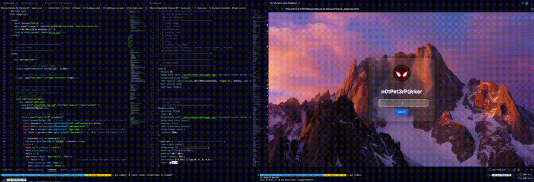

# Mac-Style Desktop (Mission 01)

Welcome to the codebase for my Mission 01 Assignment: a fun little interactive, Mac-inspired desktop interface built with **HTML** and **CSS** (plus a sprinkle of JavaScript). This project mimics the feel of macOS with a login screen, desktop icons, a dock with hover effects, and multiple pop-up app windows, all running in the browser.

---

##  Features

-  **Login screen** with password protection and animation feedback
    
-  **Desktop environment** with interactive app icons
    
-  **Glassy Dock** that floats up on hover
    
-  **Animated Dock icons** (macOS-style ripple scaling)
    
-  **Pop-up app windows** (Resume, Documents, Terminal, etc.)
    
-  **Hover tooltips using CSS only**

- **Terminal-style blinking cursor**

    

---

##  Visual Layers & Z-Index

|**z-index**|**Element**|**Visible Layer Position**|
|---|---|---|
|**2000**|`#login-screen`|Login screen (initial blocker)|
|**1500**|`.documents-window`, etc.|Popup app windows|
|**1000**|`.menu-bar`|Top Apple-style bar|
|**999**|`.dock-area`, `.chat-popup`|Bottom Dock and contact form|
|**3 → 1**|`.dock-item:hover`|Dock hover scaling|
|**0**|`.desktop-icons`|Desktop icons (base layer)|

---

## File Structure Overview

```
dock_site/
├── index.html          # Main HTML document
├── style.css           # All layout, animation, and visual styling
├── assets/             # Icons, wallpaper, resume image
│   ├── folder.png
│   ├── file.png
│   ├── messages.png
│   └── ...
```

---

##  Key Concepts Explained

### A sprinkle of JS in the Project

This project uses a little JS in two specific places to add extra interactivity:

#### 1. Login Form
Inline JavaScript is used inside the `<form>`'s `onsubmit` attribute to:

- Prevent the page from reloading
- Check if the entered password matches `"milesmorales"`
- If correct → sets the `#unlock` checkbox to `checked`, which hides the login screen
- If incorrect → shows the password hint and triggers the `.shake` animation
- Also uses `void box.offsetWidth` to restart the animation when needed

#### 2. Contact Form (Chat Popup)
Inline JavaScript is also used in the contact form popup:

```html
<form id="demo-form" onsubmit="event.preventDefault(); document.getElementById('thank-you').style.display = 'block';">
```
    

### Interactivity

All interactivity (showing/hiding windows) is done using:

- HTML `<input type="checkbox" hidden />` to store state
    
- `<label for="...">` elements as triggers
    
- CSS `:checked` + `~` combinator to show/hide elements

### See my Codepen example here for a simplified example:
- https://codepen.io/Lona-mafaufau/pen/zxxyWgY


###  Glassy Effect

This effect is created by combining **transparency** and **blur**:

```css
background: rgba(255, 255, 255, 0.1);
backdrop-filter: blur(10px);
```

- `rgba(...)`: Adds semi-transparency to the panel itself.
    
- `backdrop-filter: blur(...)`: Blurs whatever is **behind** the panel
    

Used in `.login-box`, `.dock`, etc. to create a frosted-glass UI feel.

###  Understanding `position`: fixed, absolute, relative, static

####  `static` – default (normal flow)

####  `relative` – nudged from normal spot (but still takes space)

####  `absolute` – positioned based on the nearest non-static ancestor

####  `fixed` – locked to the screen (doesn’t scroll)

Used throughout the UI to handle layers, popups, and persistent bars.

---

###  Dock Hover Ripple Effect

```css
.dock-item:hover img {
  transform: scale(5) translateY(-15px);
  z-index: 3;
}
```

With adjacent icons scaling to `1.2`, `1.1`, and using `:has(...)` for left-side hover symmetry.

#### Explanation of `:has()` and `+` in Dock Interactions

- `:has()` allows targeting an element **based on its following siblings**
    
- `+` is the **adjacent sibling** selector (only next sibling)
    
- Combined, these create ripple-style hover effects without JavaScript

- The only issue is :has() might not work on all browsers (mainly the modern ones)
    

###  Dock Reveal on Hover (Slide-Up Animation)

The Dock is hidden with:

```css
bottom: -100px;
opacity: 0;
```

Then revealed on hover:

```css
bottom: 20px;
opacity: 1;
transition: bottom 0.3s ease, opacity 0.3s ease;
```

>  This is how the dock floats up on mouse hover.

### See my Codepen example here for a simplified view:
- https://codepen.io/Lona-mafaufau/pen/NPPoPEm
###  CSS-Only Tooltips

```css
.menu-left span:hover::after {
  content: attr(data-menu);
  ...
}
```

Tooltips show extra info using pseudo-elements with content from HTML `data-` attributes.
`data-menu` has been defined in our HTML as the text shown when hovering of the top menu items.

###  Terminal Cursor Effect

```css
.terminal-content::after {
  content: "\2588";
  animation: blink 1s steps(1) infinite;
}
```

Displays a blinking block cursor just like a real terminal.

###  CSS Tilde `~` Selector: Toggling Interface Elements

```css
#toggle-form:checked ~ main .chat-popup {
  display: flex;
}
```

- `~` = general sibling selector (any sibling that comes after)
    
- Used for showing chat popup, terminal, etc.
    

### Animation Summary Table

|Animation|Target|Purpose|
|---|---|---|
|`shake`|`.login-box.shake`|Wrong password feedback|
|`fadeIn`|`.hint.flash`|Hint message transition|
|`blink`|`.terminal-content::after`|Terminal cursor effect|

###  Responsiveness

This project is optimised for desktop layout to simulate a full OS. It may work on mobile, but interaction is designed for larger screens.

###  Semantic HTML: What is `<aside>`?

Used to wrap content like the Dock that’s helpful but not the main content. `<aside>` marks it semantically as a tool, just like a sidebar or widget.

See here for a helpful in browser example:
https://www.w3schools.com/tags/tryit.asp?filename=tryhtml5_aside2

---

##  How to Run It

1. Clone or download the project
    
2. Open `index.html` in your browser
    
3. Try logging in with password: `milesmorales`
    
4. Click desktop icons and dock apps to explore interactive windows
    

---
